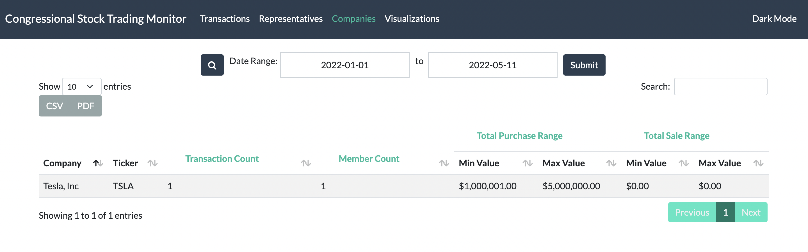
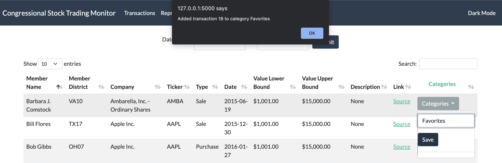

# Congressional Stock Trading Monitor

The Congressional Stock Trading Monitor will be a tool that assists users in collecting, parsing and viewing data about stock market transactions that members of the U.S. House of Representatives publically report.

## How To Run the Software

### A. Running Software Through a Docker Container

1. Open docker and a terminal window to this folder
2. Type the following docker commands into the terminal window:
    * ```docker-compose build && docker-compose up```
3. Visit http://127.0.0.1:5000/  or localhost:5000 in a browser to see the webpage.
4. When finished, run `docker-compose down` to remove leftover container artifacts.

### B. Visiting the Website

You can visit the Congressional Stock Trading Monitor webpage [here](http://cstm-testing.eba-2jr5ivme.us-east-1.elasticbeanstalk.com/).

## User Documentation

On the Congressional Stock Trading Monitor webpage, users can retrieve information and data pertaining to the U.S. House of Representatives stock market transactions. The Congressional Stock Trading monitor consists of three main pages that can be accessed through the navigation panel:
1. Transactions page (homepage): shows list of transactions
    * *Includes the following data for each transaction*: U.S. House of Representatives member name, member district, company, ticker, type of transaction (purchase/sale), lower bound value of the transaction, higher bound value of the transaction, transaction description, a link to the official pdf of the stock transaction, and an option to add/delete the transaction to a category.

    
2. Representatives page: shows list of representatives along with their aggregated purchased/sold stock data
    * *Includes the following data for each transaction*: U.S. House of Representatives member name, trade count, transaction purchase count, transaction sale count, average transaction value, lower bound and higher bound value of the purchase range, and lower bound and higher bound value of the sale range.

    
3. Companies page: shows list of companies along with their aggregated purchased/sold data
    * *Includes the following data for each transaction*: Company, ticker, transaction count, count of members having transactions with this company, lower bound and higher bound value of the purchase range, and lower bound and higher bound value of the sale range.

    

***User Directions***
* On each page, select the date range (a calender will pop up to specify specific dates) at the top of the page, and click the submit button to see transactions in the specified date range.
    * Note: To see all possible transactions, select date range 2013-01-01 to the current date.
    

***Additional Features***
* Light and Dark Mode button on the top right of the webpage
* Search through the list of transactions (accepts partial searches and is case insensitive)
* Pick to show different number of entries on the page (ex.10, 25, 50, 100). Clicking on the next/previous buttons lets you go to different pages of entries.
* The entries in the table can be sorted by each column by clicking the column name (the corresponding arrow to the right of the column name shows the direction of the sort)
* On the transaction page, the *Update Transactions to a Category* column saves the current transaction to a category through a cookie. *In future updates, the these transactions that were saved to a category will be displayed on its own page for the user.*
    * Click the "Category" button for a transaction, and type in the name of the category you want to save the transaction to.

    
    
    * Clicking the toggle will change whether the user will add the transaction to the category or delete the transaction from the category.

    * Click the button *Save*/*Delete* to save the changes in a cookie. An alert will show on the page to indicate the cookie has been updated.

    

* Highlighted column names are hoverable to show a tooltip giving more information about what the column represents. *In future updates, tooltips will be updated for more columns. The tooltips are currently shown in the Companies page*


## Developer Documentation
The goal of this application is to utilize webscraping tools to gather information from the Financial Disclosures of U.S. House of Representatives into a database. This database will be queried to provide structured and formatted data to users on the webpage, along with unique visualizations. *The website containing information pertaining to the Financial Disclosures of U.S. House of Representatives can be found at: https://disclosures-clerk.house.gov/PublicDisclosure/FinancialDisclosure.*

Our current application holds a pre-populated database of real stock transactions from the U.S. House of Representatives. The database holds the following information for 32 U.S. House of Representatives: *Representative Name*, *State District Number*, *Company*, *Ticker*, *Transaction Type*, *Date*, *Amount*, and *Description*.

This application utilizes a *Continuous Integration* and *Continuous Delivery* pipeline to automate tests.  

The repository ```congressional-stock-trading-monitor``` consists of:

### *app.py* File
The ```app.py``` file uses the Flask framework to create the web application.

### *ctsm* Directory
The ```ctsm``` directory contains backend python files to retreive, modify, and send information to the Flask application.
* ```query.py```: contains a function that returns a key-value pair as a string to assist with database queries.
* ```database_helpers.py```: connects html code form requests with queries on the database.
* ```representative_helpers.py```: contains code responsible for obtaining and processing representative information
* ```enums.py```: Contains enumerated types found in CSTM
* ```dataclasses.py```: Contains dataclasses found in CSTM

### *database* Directory
The ```database``` directory contains database files, python files for webscraping, and resulting pdf and text files from webscraping.
* ```pdfs``` directory: contains pdf files of stock transactions records for the U.S. House of Representatives.
* ```Financial_Disclosure_txt_files``` directory: contains text files of the U.S. House of Representatives, separated by year.
* ```process_congress_records.py```: python file that scrapes the U.S. House of Representatives member names and stores them as text files in the ```Financial_Disclosure_txt_files``` directory; the python file also scrapes pdf files of stock transaction records for U.S. House of Representatives members and stores them in the ```pdf``` directory. 
* ```sample_data.csv```: contains real stock transactions for 32 U.S. House of Representatives.
* ```database.db```: database file.
* ```database_schema.sql```: sql file that adds a table to the database to store all transactions.
* ```create_database_version1.ipynb```: python notebook that updates the database with data.

### *templates* Directory
The ```templates``` directory contains html files.
* ```partials``` directory: contains html files defining reusable UI components
    * ```description_modal.html```: html file defining the transaction description popup
    * ```navigation_bar.html```: html file defining the responsive navigation
    * ```transaction_table.html```: html file defining the transaction table
    * ```companies_table.html```: html file defining the companies table
* ```base.html```: html file defining the basic webpage format to extend into other pages
* ```transactions.html```: html file defining the transaction driven view
* ```companies.html```: html file defining the companies driven view

### *static* Directory
The ```static``` directory contains any scripts, css, and javascript files.
* ```darkly.bootstrap.min.css```: css file with the darkly bootstrap theme
* ```flatly.bootstrap.min.css```: css file with the darkly bootstrap theme
* ```toggle.css```: css file defining the toggle style 
* ```tooltip.js```: javascript file supporting bootstrap tooltips
* ```categories_cookies.js```: javascript file with functions to set cookies

### *tests* Directory
The ```tests``` directory contains all test files.
* ```unit``` directory: contains all unit tests
    * ```test_process_congress_records.py```: tests that ```process_congress_records.py``` webscrapes pdf files.
    * ```test_database_helpers.py```: tests the database created in ```database_helpers.py```.
    * ```test_state_enum.py```: tests the `State` enumerated type
    * ```test_transaction_dataclass.py```: tests the Transaction dataclass
    * ```test_disctrict_dataclasss.py```: tests the District dataclass
    * ```test_state_enum.py```: tests the State enum
    * ```test_representative_helpers.py```: tests the representative helper functions


### Docker Files
* ```Dockerfile```: text file that includes instructions to automatically install and configure the Docker image.
* ```compose.yaml```: configuration file that defines services, networks, and volumes for Docker containers.
* ```requirements.txt```: text file storing all the information about libraries, modules, and packages that are required for this webpage. This file is used by Docker to build the Docker image.

## Sprint 1 - Level of Effort by Each Member
* (30%) Brian Spates - Organized group meetings, dealt with merge requests and resolving probelms before merging, setup AWS, setup CI/CD pipeline, wrote tests for the database code.
* (25%) Jiaming Yao - Responsible for all code regarding the database and connecting HTML forms to the querying the database. 
* (15%) Jake Wilson - Responsible for coding webscraping python files and corresponding tests.
* (15%) Xue Qiu - Responsible for writing documentation and some html/css code.
* (15%) Michelle Zheng - Responsible for some html code and collecting data entries into a .cvs file.

## Sprint 2 - Level of Effort by Each Member
* (26%) Brian Spates - Made the backend + frontend (calendar range and datatables module) for the representatives view. Implemented continuous deployment. Made a frontend for assigning transactions to categories
* (22%) Jake Wilson - 
* (22%) Xue Qiu - Updated Transaction and Companies pages to the format from Brian. Wrote functions in database_helpers.py to assist with querying aggregated information for the Companies page, and wrote corresponding tests. Created a toggle button to connect Brian's frontend with Michelle's backend. Updated user documentation.
* (18%) Jiaming Yao - 
* (12%) Michelle Zheng - Worked on saving transaction searches(not merged/decided this feature would not be needed). Worked javascript functions to save cookies.
